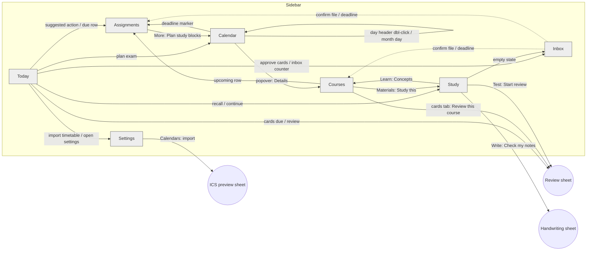

# Study Tracker: UI Screen Document

Reference for planning UI work. It describes what exists in the SwiftUI app today (`Sources/StudyTracker/`), what each screen shows, and every link between screens. Where this disagrees with [SPEC.md](SPEC.md), **this document reflects the code**.

Platform: macOS 15+, single window (default 1240×820, minimum 980×640), plus a menu bar extra. Local-first, one user, works without Claude.

---

## 1. Map

Solid arrows are navigation the user triggers. Dashed arrows are data flow: confirming something in the Inbox makes it appear elsewhere, but the app does not navigate.

### Structure

| Level | What |
|---|---|
| Window | Left sidebar + detail. No nested navigation deeper than sidebar → screen → tab or side panel. |
| Sidebar | Today, Calendar, Assignments, Courses, Study, Inbox (badge = items needing a decision). Settings is pinned at the bottom. Sidebar also shows a spinner row while Claude is running a background job ("Claude: processing …") or an import is in progress. |
| Overlays | Modal sheets (Review, ICS preview, Handwriting, Command palette, editors) and popovers (calendar). |
| Global | Toast at bottom of detail area (8 s, optional Undo). Drag-and-drop files anywhere in the window to import. |
| Outside the window | Menu bar extra (brain icon). |

### Keyboard

| Keys | Action |
|---|---|
| `⌘1`–`⌘6` | Today, Calendar, Assignments, Courses, Study, Inbox |
| `⌘,` | Settings |
| `⌘K` | Command palette |
| `⌘N` | Assignments + focus quick add |
| `⌘O` | Import files |
| `⌘Z` | Undo (only when the toast has an Undo) |
| `⌘⇧R` / `⌘⇧P` / `⌘⇧S` | Start review / Plan study blocks / Sync calendars and Moodle |
| `T`, `←`, `→` | Calendar: today, previous, next period |
| `Space`, `1`–`4` | Review: reveal, rate Again/Hard/Good/Easy |
| `Esc` | Close panel or sheet |
| `Return` | Default action (Today's suggested action, sheet confirm buttons) |

---

## 2. Design constraints (from `Theme.swift` and SPEC §7.1)

- System font, five sizes: 12 / 14 / 16 / 20 / 28. Tabular numerals for dates, times and grades.
- Near-black on white, near-white on black, following system appearance.
- **One accent colour** (`Theme.accent`, warm red) for "needs attention now": overdue, due within 48 h, next class within an hour, expired sign-in. A separate `success` green is used only in the Moodle connection screens.
- Course colours come from an 8-token palette and appear only as small dots or thin bars.
- Primary button: neutral (black on light, white on dark), ≥36 pt tall. Quiet button: subtle fill. Only one primary button per region.
- Content max width 960 (Calendar excepted). Cards are 10 pt radius, 3% fill, hairline border.
- Copy: plain, second person, no exclamation marks. Empty states are one sentence and at most one action.
- Motion ≤150 ms except the Moodle connect animation (0.4 s).
- Shared components: `Panel`, `SectionHeader` (uppercase small caps label with optional trailing action), `Chip`, `CourseDot`, `EmptyState`, `StatusPill`, row = 7 pt-radius subtle-fill bar.

---

## 3. Screens

### 3.1 Today  (`⌘1`, default screen)

**Purpose:** answer "what's next, what's due, what should I do now".

**Layout:** single scrolling column, max 960.

| # | Block | Shows | Links out |
|---|---|---|---|
| 1 | Header | Long date ("Wednesday 30 September"), greeting by time of day | none |
| 2 | Onboarding card (only when there are **no courses**; replaces everything below) | Three numbered steps: add timetable, drop slides, connect Claude | **Open Settings** → Settings. **Try it with sample data** → loads sample term, courses and a lecture, stays on Today |
| 3 | Suggested action card | Exactly one primary button and an optional detail line. Turns accent-coloured for overdue and at-risk work | See table below |
| 4 | Continue row (only if an unfinished study session exists) | "Continue: Recall · Lecture title", relative start time | Review session → reopens Review sheet. Any other kind → Study on that material |
| 5 | Next class card | Course dot, title, day/time/room, countdown ("in 2 h 10 min", accent within the hour, "Happening now"), "Changed from usual" chip | Empty state: **Import your timetable** → Settings |
| 6 | Counters card (220 pt wide) | Cards due, Inbox count | Cards due → Review sheet (disabled at 0). Inbox → Inbox |
| 7 | Due in the next 7 days | Up to 5 assignment lines (course dot, exam icon, title, course, weight chip, due relative + absolute; overdue/≤48 h in accent) | Row → Assignments with that assignment open. **See all** and **N more** → Assignments |
| 8 | Today list | Today's classes and events with time range, course dot, room, "changed" chip; past items dimmed; canceled struck through | not interactive |

**Suggested action.** First matching rule wins, computed in `TodayRules.suggest`:

| Order | Kind | Label pattern | Button does |
|---|---|---|---|
| 1 | finishOverdue | "Finish: X (overdue)" | Assignments, X open |
| 2 | startAtRisk / keepGoing | "Start: X" / "Keep going: X" (at-risk = hours needed ≥ 50% of free hours before due, or ≤48 h and not started) | Marks X *In progress* (start only), then Assignments, X open |
| 3 | planExam | "Plan study for X" (exam within 14 days, no planned block) | Generates proposed blocks focused on X → Calendar (week view) |
| 4 | review | "Review N cards (about M min)" (N ≥ 5) | Review sheet |
| 5 | recall | "Recall: lecture" | Study on that lecture |
| 6 | process | "Process lecture" | Runs Claude in background if Claude Code is installed, otherwise copies the prompt. **Stays on Today** |
| 7 | approveCards | "Approve or rewrite N proposed cards" | Inbox |
| 8 | nothing | "Nothing urgent. Next class: X." | no button |

Refreshes every 30 s and on any data change (including writes made by Claude).

---

### 3.2 Calendar  (`⌘2`)

**Purpose:** see and edit classes, deadlines, study blocks and busy time. Behaves like Apple Calendar.

**Toolbar (left to right):** period title · **Plan study** (`⌘⇧P`) · **Layers** menu · Week / Month / Agenda segmented control · ‹ **Today** › (`←` `T` `→`).

**Layers** (persisted): Classes and events · Assignments and exams · Study blocks · Busy time · Canceled classes.

**Week (default).**
- Seven day columns × 24 h grid, gutter of hour labels, scrolls to 07:00 on open. A "now" line with dot on today. Area before the study-window start is faintly shaded.
- Day headers: weekday, date (today in accent), all-day items underneath.
- Items in a column: class/event blocks (course-coloured bar, title, time, room as height allows; busy time is grey; canceled is struck through at 45% opacity; modified shows a small change icon), study blocks, deadline markers. Overlaps sit side by side.
- Study blocks: dashed outline = proposed, solid = planned, faded with tick = done.
- Deadline markers: flag = assignment, larger filled square = exam. Accent outline when overdue or due within 48 h.

**Month.** Six-week grid. Per day: date, up to 3 lines total of deadlines first then classes, "+N more". Hides busy time and **does not show study blocks**.

**Agenda.** Next 30 days from the current date, grouped by day with a long-date header. Deadlines, classes/events/busy, study blocks (with "proposed" chip). Empty days are omitted.

**Interactions and where they lead:**

| Gesture | Result |
|---|---|
| Click empty slot in week | **Slot quick add** popover at that 30-minute time: segmented *Assignment due* / *Event*, title, course, Add |
| Click a class/event | **Occurrence popover**: title, date/time, room, note, canceled chip. **Edit** (inline date, start, end, room), **Cancel this class** / **Restore**, **Details** → Courses on that course (Overview tab). Busy blocks have no actions |
| Drag a class (move) or drag its bottom edge (resize), 15-minute snap | Recurring class → **Scope dialog** (*This class only* default / *This and following* / *All*, with "This changes N classes"). One-off event → applies immediately. Toast with Undo either way |
| Click a study block | Popover: proposed → **Accept** / **Dismiss**; planned → **Done** / **Skipped** / **Remove**; done → **Undo done**. Shows "Proposed by Claude" chip if relevant |
| Click a deadline marker | Assignments with that assignment open |
| Double-click a day header (week) | Agenda starting that day |
| Click a day (month) | Week containing that day |
| Click a deadline row in Agenda | Assignments with that assignment open |
| **Plan study** | Generates proposed blocks for the next three weeks around classes and busy time, jumps to week view on today, toast "Proposed N study blocks. Accept the ones that work." |

Class and study-block rows in Agenda, and all of Month except the day cell, are not interactive.

---

### 3.3 Assignments  (`⌘3`)

**Purpose:** track deadlines, weights, status and grades.

**Layout:** main column (header + list or board) and an optional 360 pt **detail panel** on the right.

**Header:** title · course filter (All courses or one) · list/board toggle · **Quick add bar**. Both filter and view mode persist.

**Quick add bar** (`⌘N` focuses it): one text field, e.g. `Pricing report HM210 fri 5pm 30% 6h`. As you type, a chip row shows what was understood: course picker (highlighted when missing or ambiguous), due, weight, hours, kind, and the remaining title. `Return` or **Add** saves; it refuses to guess a course. Toast with Undo.

**List view** groups: Overdue (accent) · Due this week · Later · No date · Done (collapsed). Each group shows 7 rows then "Show N more". Groups collapse.

**Row:** status menu (Not started / In progress / Submitted / Graded) · course dot · exam icon · title · course name, group-work icon, "Moodle" source tag · grade chip (graded only) · weight chip · hours chip · due (relative + absolute; accent when overdue or <48 h). Click selects and opens the detail panel. Rows are draggable.

**Board view:** four columns by status with counts. Cards: course dot, title, due, weight. Drag a card to a column to change status (toast with Undo). Click opens the detail panel.

**Detail panel:** Close (×, `Esc`) · title · form: Course, Kind, Status, Due toggle + date picker, Weight %, Estimate h, Score, Out of, Minimum to pass %, Group members, Rubric/brief (picks from that course's materials) · "Earned x of y points of your final grade" · Notes · "From *material*, *locator*" when created from a document · **Open in Moodle** (external browser link) · Study blocks for this assignment (date, minutes, status) · **Save** (`⌘S`, enabled when edited) · **More**: *Plan study blocks* → Calendar; *Copy "check draft against rubric" prompt* → clipboard (paste into Claude Desktop); *Delete* (undo toast).

**Empty state:** "No assignments yet. Type one above…".

Notes:
- Items proposed by Claude, Moodle or an .ics file are **not** shown here until confirmed. They live in the Inbox.
- The selected assignment is remembered across screens: returning to Assignments reopens its panel.

---

### 3.4 Courses  (`⌘4`)

**Purpose:** everything about one course: grade, schedule, materials, concepts, notes, flashcards.

**Layout:** 240 pt course list on the left; course page on the right.

**Course list:** heading + **+** (add course). Rows: colour dot, display name (code or short name), secondary name. Archived courses are dimmed. Adding requires a term; otherwise a toast sends the user to Settings.

**Course page header:** dot, name, code, **Edit** (Course editor sheet), instructor, then five tabs.

| Tab | Content | Links out |
|---|---|---|
| **Overview** | **Grade card**: current grade on the course's scale, target, headline sentence, progress bar with target marker, "Earned x of y graded points · z open", weight warning, minimum-to-pass warnings, prompt to set a target. **Weekly schedule**: class times with day, time, room, valid range, Edit; **Add class time**. **Upcoming**: up to 7 open assignments. **Concepts flagged weak recently**. | Upcoming row → Assignments (assignment open). Class time → Pattern editor sheet |
| **Materials** | Drop zone / **Add files…**. Row: type icon, title, role, slide/part count, "N with pictures", concept count, *Processed* chip, error text for failed or OCR-needed files. Row menu: Open file · **Study this** · Process with Claude now (or copy prompt) · Copy *process lecture* prompt · Copy *extract deadlines* (syllabus, brief) · Copy *past exam patterns* (past exam) · Copy *practice problems* · Role submenu · Move to Trash | Study this → Study on that material |
| **Concepts** | Filter field; grouped Core / Supporting / Detail. Each: name, "yours" chip, **Explain it** (copies Feynman-check prompt), definition, sources (`material: slide numbers`), outgoing links (`relation → other concept`). **Add your own concept** form (name, definition). | Explain it → clipboard |
| **Sheets & notes** | List of Cornell sheets, gap reports, rubric checks, your notes, with kind, author (Claude or You), date. Cornell sheets: **Print**, **PDF**. **Open** → Note viewer sheet (rendered Markdown; Delete for your own notes). **New note** → Note composer sheet | Print/PDF → system print or opens PDF |
| **Cards** | "N cards · M due" + **Review this course**. *Proposed by Claude* (edit front/back, **Approve** or **Save my version**, **Discard**). **Write a card**. *Practice questions – add to deck* (30 max). **Deck** (first 100; state, due, **Suspend**). **Suspended** (**Restore**). | Review this course → Review sheet |

**Sheets:** Course editor (code, name, short name, instructor, other names, type, term, colour, grading scale, target grade, pass mark, archived; Delete course) · Pattern editor (day, start, end, room, first/last class; Remove).

---

### 3.5 Study  (`⌘5`)

**Purpose:** run the four-step method on one lecture, and check whether it's working.

**Header:** title · segmented **Lecture / Insights** (persisted) · **Review N cards** (disabled at 0).

**Lecture tab.** Left: 260 pt list of filed lectures and readings that are ready (course dot, title, course, tick if processed). Right: the flow for the selected item.

- Title; "Course · processed 2 days ago".
- "Concepts recalled n of N" progress bar (only after processing).
- Four **step cards** in a row. The step that should happen next gets the primary button; done steps show a tick:

| Step | Says | Buttons | Leads to |
|---|---|---|---|
| 1 Recall | "Write what you remember before looking." | **Copy prompt** (disabled until processed) | Clipboard + opens Claude Desktop |
| 2 Learn | "Claude reads the lecture and builds concepts…" or "N concepts, linked to their slides." | Before processing: **Process** (background Claude Code run, or copy prompt) + "Copy prompt instead". After: **Concepts** | Concepts → Courses ▸ Concepts tab |
| 3 Write | "Fill the sheet by hand from memory, then photograph it." | **Print sheet** (if a sheet exists), **Check my notes** | Print dialog; Handwriting sheet |
| 4 Test | "N cards from this lecture." | **Start review**, "Copy quiz prompt" | Review sheet; clipboard + Claude Desktop |

  Next step logic: not processed → 2; not recalled → 1; no handwriting capture → 3; else 4.
- **Sessions** (last 8: kind, summary, date) and **Gap reports and notes** (expandable Markdown).
- Empty state: "File a lecture under a course and it shows up here…" + **Go to Inbox**.

**Insights tab** ("Is this working?"): three stat panels (On-time rate + missed count; Card retention 30 d + review count; Recalled within 48 h n/N) · bar chart of study minutes per week (8 weeks) · Grades against targets per course · Concepts flagged weak most often with **Explain it** · Techniques used (counts per session kind).

---

### 3.6 Inbox  (`⌘6`)

**Purpose:** the single place where things wait for a decision. The sidebar badge counts unfiled and unreadable files, ready lectures and readings, proposed deadlines, Claude's proposed study blocks, conflicts and proposed cards. It does **not** count the "Syllabi, briefs and past exams" section, so the badge can be lower than what the screen lists.

**Header:** title · **Add files** · **Inbox folder** (opens `~/StudyTracker/Inbox` in Finder) · **Clear all…** (confirmation lists what will happen to each kind).

Sections appear only when non-empty, in this order:

| Section | Row shows | Actions |
|---|---|---|
| Files to file | Title, filename, page count; suggested course pre-selected | Role picker, Course picker, **Confirm** (default action), Remove. Failed files show the error and Remove only |
| Ready to process | Course dot, title, course · role | **Skip**, **Copy prompt**, **Process with Claude** (if Claude Code is present). Header link **Process all with Claude** when more than one |
| Syllabi, briefs and past exams | Same | **Skip**, **Copy prompt** (extract deadlines or exam patterns) which also opens Claude Desktop |
| Proposed deadlines | Title, due, weight, source ("from Claude" / "from MOODLE" / "from ICS"), locator | Course picker, **Dismiss**, **Confirm** |
| Study blocks proposed by Claude | Focus, time, minutes | **Dismiss**, **Accept**; header **Accept all** |
| Flashcards to approve | Editable front/back, source locators (first 12) | **Discard**, **Approve** / **Save my version**; header **Approve all** |
| Conflicts | Summary of an import that touches something the user edited | **Keep mine**, **Use Moodle's / calendar's** |
| Could not read | Title, reason | **Remove** |

Empty state: "Nothing needs a decision. Drop slides or PDFs anywhere in this window to add them." + **Add files**.

Confirming a file or deadline does not navigate; the item appears in Courses ▸ Materials or in Assignments.

---

### 3.7 Settings  (`⌘,` or sidebar bottom)

Left list of seven sections (remembered), version footer, content column max 760.

| Section | Contents |
|---|---|
| **General** | Time zone · Week starts on · Default due time · Day/month date entry toggle · Paper size for Cornell sheets · **Study planner**: window start/end, max hours per day, default hours for exams and other work |
| **Terms and breaks** | Term cards (name, dates, Current chip, Edit) each with breaks list and add-break row · **Add term** → Term editor sheet |
| **Calendars** | **Import .ics file…** → ICS preview sheet · **Subscribe to a calendar link…** → Feed sheet → ICS preview · **Sync now** · list of sources (school or busy, last synced, status, Remove) · help panel on where to find links |
| **Moodle** | Two states, see 3.7.1 |
| **Claude** | Connection panel (**Connect to Claude Desktop** / Reconnect, **Install as extension instead**, **Copy config snippet**, Disconnect) · Status (database path, MCP server path, schema version match, last Claude activity) · Claude Code panel (CLI found or not, toggles: use for Process buttons, process new lectures automatically, **Look again**) · Prompts (Copy weekly plan prompt, Open Claude) |
| **Apple Calendar and alerts** | Toggle Show in Apple Calendar · Toggle Deadlines in Reminders · sync status · Notifications toggle, class reminder minutes, morning summary time · **Export an .ics file** |
| **Data and export** | Your files (open Study Tracker folder, Inbox, Library, Exports; database path) · Backups (last backup, **Back up now**, **Show backups**) · Export (**Everything (JSON + Markdown)**, **Flashcards for Anki**, Obsidian vault picker + **Export to Obsidian**) · Sample data (load / remove) |

Nothing outside Settings can deep-link to a specific section. See §6.

#### 3.7.1 Moodle section

**Not connected:**
1. Card: link graphic (idle), "Connect your Moodle", address field with live school lookup (checking spinner → found ✓ / app access off ⚠ / not found ?), caption ("Found *School* · signs in with *Microsoft Office 365*"), primary **Connect with {provider}** button, reassurance line about passwords.
2. "What comes in" tiles: Deadlines, Grades, Course files.
3. Disclosure **Other ways to connect**: segmented *Username and password* / *Security key*, fields, **Connect**.

**Sign-in sheet** (580×740): header with lock, school name, address bar showing host and HTTPS state · the school's own login page in a web view · footer reassurance. Cancel. On success shows a "Signed in" check and closes itself after ~1 s.

**Connected:**
1. Status card: link graphic (connected / connecting / broken), pill (*Connected securely* / *Importing from Moodle* / *Sign-in expired*), school name, host + "Signed in as …". During first import: three-step progress. After it: one-time "You're connected" welcome banner, then four stat tiles (courses linked, deadlines, grades, files). Footer: sync status ("Synced 5 minutes ago · checks every 3 hours", or failure text) + **Sync now**; or, if expired, explanation + **Reconnect with {provider}** (reopens the sign-in sheet).
2. **Courses**: each Moodle course with a link picker (Not linked / any local course) and **Create course** when unlinked. "N of M linked". Only linked courses import.
3. **Sync**: toggles *Download new course files*, *Add deadlines straight to your list* (off → deadlines wait in the Inbox).
4. **Security**: key in Keychain, password handling (depends on how they signed in), read-only, HTTPS. **Disconnect…** (confirmation).

---

## 4. Overlays and global surfaces

| Surface | Trigger | Shows | Leads to |
|---|---|---|---|
| **Command palette** (560 pt sheet) | `⌘K` | Search field; up to 12 results, arrows + Return. Sources: all screens (including Settings) · actions (Add assignment, Import files, Start review, Plan study blocks, Sync, Copy weekly plan prompt, Open Claude) · every course · every open assignment · up to 60 materials (labelled "Lecture") | Screen; Courses; Assignments with item open; Study on material |
| **Review sheet** (640×480) | Cards due (Today, Study, Course ▸ Cards), `⌘⇧R`, palette, menu bar | Progress "3 of 20", course dot, card front, **Show answer** (`Space`), answer + source locator, four rating buttons each with next interval, "Keys 1–4 rate your own recall". End: "You recalled N of M. K cards moved to longer intervals." with **Continue with N more** and **Done**. Close mid-session logs what was reviewed | none (dismiss returns to where it was opened) |
| **Handwriting sheet** (560 wide) | Study ▸ Write ▸ Check my notes | Step 1: drop zone (also accepts Continuity Camera "Import from iPhone"), **Choose photo…**. Step 2: "Your notes mention n of N concepts", missing concepts, caveat, **Get Claude's review** (background run or copy prompt + open Claude), **Show photo**, expandable OCR text | Claude; Finder |
| **ICS preview sheet** (560 wide) | Import .ics, drop an .ics, subscribe to a link | Role choice (school vs busy time), summary sentence, new courses, weekly classes with action, count of canceled/moved classes, first 12 events, deadlines ("you'll confirm them in the Inbox") | **Import** → toast; deadlines go to Inbox |
| **Scope dialog** (420) | Drag/edit a recurring class | Change description, three radios, affected count | Apply |
| **Toast** | Any write | Message, optional **Undo** (`⌘Z`), dismiss. 8 s. Errors show a warning icon | Undo reverses the change |
| **Course editor / Pattern editor / Term editor / Feed sheet / Note viewer / Note composer** | See owners above | Forms | Save / Cancel / Delete |
| **Sidebar activity rows** | Claude run, file import | Spinner + label | none |

**Menu bar extra** (300 pt popover): *Next class* (title, time, room, countdown) · *Suggested* (text only, **not clickable**) · *Due soon* (up to 4, text only) · **Open Study Tracker** · **Review N** (when cards are due; opens window and starts review).

**Drag-and-drop import:** dropping files anywhere on the window (or into the Courses ▸ Materials area, which pre-assigns the course) sends supported files to the Inbox and shows a toast. `.ics` files open the ICS preview instead. The `~/StudyTracker/Inbox` folder is watched while the app runs.

---

## 5. Link matrix

Rows are where the user is; columns are where they can go. `→` navigates; `sheet` opens a modal; `copy` puts a prompt on the clipboard (and often opens Claude Desktop); `bg` starts a background Claude job.

| From ↓ / To → | Today | Calendar | Assignments | Courses | Study | Inbox | Settings | Review | Other |
|---|---|---|---|---|---|---|---|---|---|
| **Today** | | plan exam | suggested, due rows, See all | | recall, continue | approve cards, counter | onboarding, import timetable | cards due, review | bg: process |
| **Calendar** | day nav only | | deadline markers, agenda rows | popover Details | | | | | scope dialog, quick add |
| **Assignments** | | More ▸ Plan study | | | | | | | copy: check draft; external: Moodle |
| **Courses** | | | Upcoming rows | | Materials ▸ Study this | | new course w/o term | Cards ▸ Review this course | copy: process, deadlines, exam patterns, practice problems, Feynman; bg: process; Finder/Open file; print/PDF |
| **Study** | | | | Learn ▸ Concepts | | empty state | | Test, header button | Handwriting sheet; copy: recall, quiz, Feynman; bg: process |
| **Inbox** | | | | | | | | | bg/copy: process, deadlines, exam patterns; Finder: Inbox folder |
| **Settings** | | | | | | | | | ICS preview; Moodle sign-in sheet; Claude Desktop config; Finder |
| **Palette** | any | | open item | open course | open material | | yes | start review | actions |
| **Menu bar** | | | | | | | | Review N | opens main window |

Reverse view: **what leads into each screen.**

| Screen | Entered from |
|---|---|
| Today | Sidebar, `⌘1`, app launch (default) |
| Calendar | Sidebar, `⌘2`, Plan study (Today, Calendar toolbar, Assignment More, `⌘⇧P`, palette) |
| Assignments | Sidebar, `⌘3`, `⌘N`, Today (suggested, due rows), Calendar (deadline marker, agenda row), Courses ▸ Overview (upcoming), palette |
| Courses | Sidebar, `⌘4`, Calendar popover Details, Study ▸ Learn ▸ Concepts (lands on Concepts tab), palette |
| Study | Sidebar, `⌘5`, Today (recall, continue), Courses ▸ Materials ▸ Study this, palette |
| Inbox | Sidebar, `⌘6`, Today (counter, approve cards), Study empty state |
| Settings | Sidebar bottom, `⌘,`, Today (onboarding, import timetable), Courses (new course without a term), palette |

---

## 6. Observations to resolve in planning

Things found while reading the code that a redesign should decide on deliberately.

**Navigation gaps**
1. Settings cannot be deep-linked. Today's **Import your timetable** and Courses' "Add a term first in Settings → Terms" both land on Settings at whichever section was last open. Copy elsewhere says "Settings → Calendars", "Settings → Data", "Settings → Terms" as plain text.
2. No screen shows a single **material** in full. Materials appear as rows in Courses ▸ Materials, in the Study list (only filed lectures and readings), and in the Inbox. Syllabi, briefs and past exams are never reachable from Study.
3. From Calendar's popover, **Details** always opens the course Overview; there is no link to that course's assignments or materials.

**Inconsistent interactivity**
4. Menu bar "Suggested" and "Due soon" look like list items but do nothing. Today's "Today" list, Agenda class rows, Agenda study-block rows, and Month cells (beyond the day click) do nothing.
5. Month view omits study blocks and busy time, so a planned week looks emptier there than in Week or Agenda.
6. Assignments' selected panel persists across screen changes; Courses' selected course and tab also persist. Study's selected material persists. Nothing signals this.

**Claude hand-off is split three ways**
7. Depending on whether Claude Code is found and the *Use Claude Code* setting, the same button either runs a background job (sidebar spinner + toast when finished), or copies a prompt and shows a toast telling the user to paste it in Claude Desktop, or copies and also opens Claude Desktop. The label changes ("Process" / "Copy prompt" / "Process with Claude") and there is no persistent place to see what Claude did, other than Settings ▸ Claude ▸ Last Claude activity.
8. Only one background Claude job runs at a time; a second attempt shows an error toast.

**Recovery**
9. Deleting a course, term, material ("Move to Trash") or clearing the Inbox shows a toast **without Undo**. Assignment deletion, edits, status changes and schedule edits do have Undo.

**Copy vs spec**
10. SPEC §7.3 lists the suggested-action rules with different thresholds (48 h start, 7-day exam). The code has eight outcomes and a 14-day exam window (§3.1 above). Update the spec or the code.
11. SPEC lists ⌘1–⌘6 for sidebar screens only. Settings has ⌘, and is also reachable from the palette.

**Density**
12. Course page tabs (Materials, Concepts, Cards) are long single lists with no pagination beyond hard caps (Deck 100, questions 30, Inbox cards 12). Concepts and Materials have no sort.
13. Settings ▸ Moodle is the only screen that uses a second colour (green) and animation; everything else follows the one-accent rule.
14. The Study screen's four step cards stay at fixed height with different amounts of content per step.

---

## 7. File map

| Screen / surface | Source |
|---|---|
| App shell, sidebar, toast, `Screen` enum | `App/StudyTrackerApp.swift`, `App/AppModel.swift` |
| Today | `Views/TodayView.swift`, rules in `StudyCore/Today/SuggestedAction.swift` |
| Calendar | `Views/CalendarView.swift` |
| Assignments | `Views/AssignmentsView.swift` |
| Courses | `Views/CoursesView.swift` |
| Study, Review, Handwriting, Insights | `Views/StudyView.swift` |
| Inbox, ICS preview | `Views/InboxView.swift` |
| Settings | `Views/SettingsView.swift`, `Views/MoodleSettingsView.swift` |
| Command palette, menu bar | `Views/PaletteAndMenuBar.swift` |
| Theme and shared components | `Components/Theme.swift` |

All paths under `Sources/StudyTracker/`.
